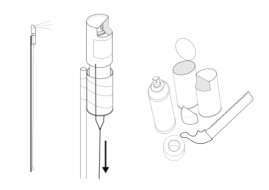
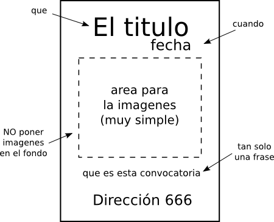
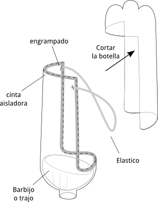
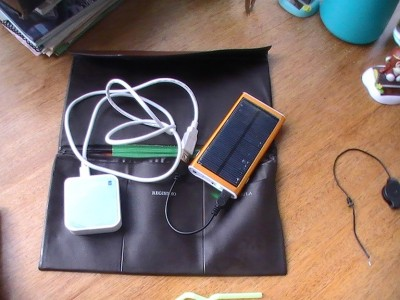
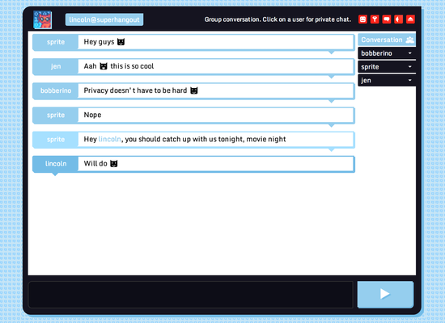
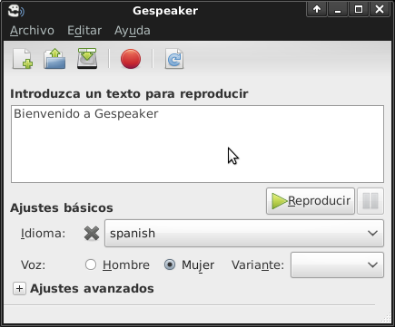
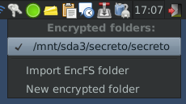

# Manifestante DIY

* [Descargar Poster para imprimir](http://b4zz4.github.io/ManifestanteXXI/poster/poster.png)
* [Descargar EPUB](http://b4zz4.github.io/ManifestanteXXI/ManifestanteDIY.epub)

> * Casco y protección para la bici para protegerse de la represión
> * Pañuelo en la cara, pasamontaña o [mascara](#mascara): contra el gas lacrimógeno y el [reconocimiento facial](#reconocimiento-facial)
> * [Guante de cuero curtido](#guante-de-cuero-curtido), para sostener las bombas de gas lacrimógeno
> * Ropa de la [gratisferia](textos/Gratiferia.md) para que no te identifiquen con ella y taparte la cara
> * [Edison Carter](#edison-carter): cámara grabando y transmitiendo en vivo
> * Teléfono con [ManifestDroid](#manifestdroid): comunicación criptográfica (SMS, llamadas, chat, etc), publicar fotos sin exponer a los manifestantes, etc.
> * Botella con vinagre, jugo de limón o [neutralizante](#neutralizante): para protegerse del gas lacrimógeno
> * [Mochila con router WIFI](#mochila-wifi) para mejorar el acceso a la red
> * Antenas para transmitir con mayor potencia
> * [Linterna estroboscópica](#linterna-estroboscopica) para calmar a las fieras
> * Protección para [identificaciones con RFID](#proteccin-para-documentos-con-rfid)

## Reconocimiento facial

En el 2011 Cristina Fernández de Kirchner emitió un Decreto ordenando la creación del Sistema Federal de Identificación Biométrica ([SIBIOS](textos/SIBIOS.md)), un servicio de identificación biométrica centralizado, con cobertura nacional, que permitirá a las agencias de seguridad hacer "referencias cruzadas" de información con datos biométricos, con la posibilidad de vincular el sistema de registro facial obtenido a través de las cámaras de vigilancia en la vía pública con las imágenes obtenidas a través de sistema SIBIOS.

El reconocimiento de rostros es cada más simple y barato, por ejemplo en la Ciudad de Buenos Aires las [cámaras de seguridad](http://camaras.buenosaires.gob.ar/) superan las mil y las redes sociales con reconocimiento facial: facebook, google+, flickr, etc, son cada vez más populares y la actualización permanentemente por parte de sus usuarios mejora las bases de datos constantemente.

En Android podemos usar el programas [ObscuraCam](https://guardianproject.info/apps/obscuracam/) que oculta las caras de forma automática.

### ¿Que podemos hacer?

* Bloquear o deshabilitar las cámaras de seguridad
* No etiquetar fotos en redes sociales
* Solo compartir fotos de manifestaciones con rostro borrados
* Borrar datos de localización y metadatos de las fotos. 

## Volantes y Poster

Un volante tiene que ser facíl de leer, expresar facilmente una problematica, proponer una acción concreta.
Tiene que decir, donde, cuando y como nos tenemos que manifestar o que es lo que se necesita hacer.
Usar valores de alto contraste (blanco y negro) para soportar fotocopias.
Para diseñarlo podemos usar [Inkscape](http://inkscape.org). Y el formato que usemos tiene que servir para hacer posters y volantes.

### Que formatos usar

Para diseñarlo lo mejor es usar SVG y para imprimirlo PDF o JPG (no menores a 5000px de ancho o alto)

### Errores más comunes

- Ser demaciado extenso
- Contar detalles innecesarios o muy puntuales
- Poner imagenes de fondo
- NO proponer acciones, lo cual deja al lector imposibilitado a participar
- Usar grises y al fotocopiarlo se vea feo 
- Un volante NO es un diario
- Que el formato no soperte impresiones a varios tamaños.

### Engrudo

En una olla disolver la harina en un poco de agua, hasta que no haya grumos y luego añadir la otra revolviendo para integrar ambos 
ingredientes. Llevar la preparación a fuego suave y revolver con cuchara de madera. Continuar revolviendo hasta que comience a hervir y 
en ese momento, retirar del fuego. Dejar enfriar. Tambien se le puede agregar un poco de sodacaustica que mejora la efectividad del pegamento.

_**Nota:** puede hacerse sin cocinar._

#### Ingredientes

* 100 gramos de harina
* 1 litro de agua fría

## Protección para documentos con RFID

Los sistemas [SUBE](textos/SUBE.md), [AFA plus](textos/AFA.md) y los nuevos DNI dan la posibilidad identificar a personas a distancia. La tarjeta SUBE genera un registro de todos los viajes que realiza, violando el derecho a la privacidad, y los guarda en una base de datos controlada por la Secretaría de Transporte. En algunos países ya se a usado este sistema para identificar manifestantes, ya que los lectores de RFID pueden ser leídos a la distancia, como puede verse en el documental "[La Police Totale](http://websuterfuge.free.fr/rfid.html)"

> Estuche **anti-RFID**, armado con un tetra pak, bloquea las ondas de radio así no es detectable a larga distancia. En el caso de la tarjeta SUBE para utilizarla hay que sacarla de su estuche. 

### ¿Que podemos hacer?

* No usarlos
* No renovar el DNI
* Intercambiar tarjetas SUBE
* Usar el estuche

## [ManifestDroid](apk/)

Tanto en las computadoras como los dispositivos portátiles (celulares, pad, tablet, etc) estamos muy mal acostumbrados a comunicarnos de modo inseguro, conectándonos a cualquier red disponible, comunicarnos y navegar sin criptografía, pudiendo cualquier persona cercana a nosotros interceptar lo que estamos haciendo, además de la compañía de celular o internet pueden hacerlo todo el tiempo.

Para solucionar este problema se pueden usar varias tecnologías de criptografía, tuneles, filtros y proxys en particular para dispositivos que usan **Android** solamente usando [software libre](https://www.gnu.org/philosophy/free-sw.es.html) fáciles de instalar y usar.

La **criptografía** es como si inventáramos nuestro propio idioma para hablar con una persona, aun así para nosotros sigue siendo totalmente legible.
Esto sirve para que nadie pueda interceptar la conversación.
Algo muy sencillo que se puede hacer es navegar en paginas con _https://_ en lugar de _http://_, esto funciona en muchas paginas populares.
Lo mejor es usar [HTTPS Everywhere](https://www.eff.org/https-everywhere) en Firefox que lo hace automáticamente.

Los **proxys** nos permite pasar por internet sin que nadie pueda ver que estamos haciendo. Uno de los mas populares es Tor que su particularidad es que esta compuesto por miles de computadoras que se coordinan de modo descentralizado, haciéndolo muy seguro y confiable. 
La versión para Android se llama [Orbot](https://f-droid.org/repository/browse/?fdfilter=browser&fdid=org.torproject.android), nos permite navegar con [Orweb](https://f-droid.org/repository/browse/?fdfilter=browser&fdid=info.guardianproject.browser), chatear de anónimo y seguro con [Gibberbot](https://guardianproject.info/apps/gibber/) y buscar en [Duck Duck GO](http://f-droid.org/repository/browse/?fdfilter=duck&fdid=se.johanhil.duckduckgo).

Los **túneles** nos permite pasar por la red sin que se pueda ver que estamos haciendo, como su nombre lo dice, generamos un _"túnel"_ dentro de la red y salimos por otro de modo anónimo. 
Hay que tener en cuenta que la maquina de salida a diferencia de **tor** conoce el lugar de procedencia, siendo que nuestra conección es directa, por ende tenemos que confiar en él.
Podemos usar la VPN de Riseup descargando [Open VPN setting](http://f-droid.org/repository/browse/?fdfilter=openvpn&fdid=de.schaeuffelhut.android.openvpn) y [configurandolo](https://help.riseup.net/es/openvpn-android) para Android.

Los **filtros** más simple que podemos usar son los de publicidad como [Adblock](https://f-droid.org/repository/browse/?fdfilter=adblock&fdid=org.adblockplus.android) quita la publicidad de las paginas web, aunque parezca algo trivial mejora muchísimo la velocidad de navegación, y al igual que [NoScript](http://noscript.net/nsa/) que nos permite mejorar la seguridad de nuestra navegación por la web.

Hay que tener en cuenta que cuantos más seamos usando estos recursos (cifrado, proxys, túneles, etc) **todo el tiempo**, no solo para hacktivismos, **más seguro** se tornan, por que generamos tráfico cifrado todo el tiempo y más complicado se vuelve encontrar los grupos de activistas.

Para instalar muchas de estas cosas vamos a necesitar tener [Superuser](https://f-droid.org/repository/browse/?fdfilter=superuser&fdid=org.fdroid.superuser).

### Comunicación segura y coordinación

Una de las grandes ventajas de los policías en una manifestación, es que se encuentran organizados, pueden comunicarse en tiempo real, modificar sus movimientos y planificar en base a lo ocurrido. Para esto cuentan con un grupo dedicado a esta función que esta fuera y dentro de la acción.

Lo mismo podemos hacer los manifestantes, organizándonos con **herramientas similares**, **libres** y **seguras**. Lo mejor es que un grupo en particular se dedique a la coordinación, utilizando con Bounjour, Jabber o telefonía sobre internet. Al igual que los policías, puede coordinarse la inteligencia por fuera de la manifestación, las personas calmadas piensan mejor, en este caso el grupo de acción debe pasar reportes precisos de lo que ocurre. La mayoría de la comunicación (a nivel inteligencia) debe hacerse por chat, en medio de una manifestación hablar se tornarse complicado e inseguro. Además escribiendo de modo preciso se puede logran mejores resultados, sobre todo en grandes grupos. **Es sumamente necesario que se usen métodos criptográficos**, el más común y seguro es el [OTR](textos/OTR.md).

* [Gibberbot](https://guardianproject.info/apps/gibber/) chatea de modo [criptográfico](http://wiki.partidopirata.com.ar/Gibberbot_con_OTR) y seguro en bounjour, jabber, facebook, googletalk, etc.
* [Yaaic](https://f-droid.org/repository/browse/?fdfilter=irc&fdid=org.yaaic) Cliente para IRC
* [CsipSimple](https://code.google.com/p/csipsimple/) telefonía por internet con criptografía, podes crear un cuenta local para la red libre y una cuenta en [ekiga.org](https://www.ekiga.net/?page=register) para acceso desde internet.
* [Ostel](https://ostel.co/) Llamadas con criptografía.
* [Umap](http://umap.openstreetmap.org.ar) mapas para coordinarse en las calles.

Es recomendable **no usar** la red telefónica convencional, pero en caso de necesitarse estos programas resultan muy útiles.

* [RedPhone](http://www.whispersystems.org/) Llamadas con criptografía sobre telefonía móvil.
* [TextSecure](http://www.whispersystems.org/) SMS con criptografía.

#### Difusión con Android

* [ObscuraCam](https://guardianproject.info/apps/obscuracam/) protege a los manifestantes borrando sus caras y quita los datos de GPS y modelo de celular cuando compartís sus fotos internet.
* [Multi Sms](http://f-droid.org/repository/browse/?fdfilter=sms&fdid=com.hectorone.multismssender) enviar SMS en cadena, puede usarse para la difusión previa o comunicarse con teléfonos sin Android.
* [Wifi Camera](https://f-droid.org/repository/browse/?fdfilter=webcam&fdid=teaonly.droideye) Transmision en vivo y directo de video y audio con tu Android. A través de la red 2G y 3G puede llegar directamente a internet.

#### Red libre con Android

Muchos dispositivos con Android no son celulares, así que no tienen acceso a internet permanente y en el caso de los celulares internet puede ser interrumpida, limitada o bloqueada, por eso es preferible armar nuestra propia red así podremos chatear con Bounjour, compartir archivos y conectarnos con diversos equipos. Además muchos dispositivos permite compartir internet dentro de la misma red libre usando el 3G.

* [Barnacle Wifi Tether](https://f-droid.org/repository/browse/?fdfilter=Barnacle%20Wifi%20Tether&fdid=net.szym.barnacle) arma tu propia red libre en malla con Android.
* [Share via HTTP](https://f-droid.org/repository/browse/?fdfilter=share%20via%20http&fdid=com.MarcosDiez.shareviahttp) comparte archivos en la red.

## Gas lacrimógeno

De verse afectado de forma real o potencial por este tipo de armas, es necesario conocer las medidas utilizadas para mantener el control de la situación.

### Mascara

> Corte la **botella de 2 litros** con la forma de su rostro y colocar los **elásticos** de manera que la botella quede firme a la cabeza.
> Colocar **cinta aisladora**, en los bordes, de modo de evitar que entre gas en la máscara, sino puede lastimar los ojos.
> Encastre en la base **un barbijo** o trapo humedecido con vinagre, jugo de limón o **neutralizante** 

## Guante de cuero curtido

Generalmente, la "bomba" se puede agarra y lanzar a otra dirección, aunque hay que protegerse las manos con un **paño húmedo grueso** o **guantes** de protección, ya que la bomba se calienta hasta alcanzar altas temperaturas, además, hay que considerar que, quien la tome se verá rodeado de gas momentáneamente.

### Neutralizante

> Prepare un neutralizador en **un roseador** con agua potable con 5% de **bicarbonato de sodio**.
> El roseador no tiene que ser mayor que 500cm3 (medio litro) por que se vuelve pesado, difícil de manejar o llevar colgado.

#### ¿Que podemos hacer?

- Rosearse neutralizante en ojos y boca, sin frotar.
- Protegerse la nariz y la boca con un trapo empapado de vinagre, neutralizante o jugo de limón.
- Ponerse un pedazo de limón en la boca.
- No llevar lentes de contacto o [usar protección](#mascara).
- Evitar que el gas alcance los ojos, para ello se pueden llevar preparadas gafas de buceo, una [mascara](#mascara) o en todo caso cerrarlos y llevarlos hacia el suelo, ya que el gas se disipa hacia arriba.

## Linterna estroboscópica

Estas luces se usa para control mental, inducir al sueño o poner en estado de trance en las velocidades adecuadas producen estado de calma, somnolencia o la sensación de falta de tiempo. 
En las frecuencias entre _5hz_ a _7hz_ produce un estado de calma, eso es lo que intenta generar el este circuito. Podemos modificar una linterna que use entre 5v a 12v con este circuito, y reutilizar su lamparas LED y baterías.

> Uno o más LED, circuito integrado 555, resistencias de 47k, 82k y 1k, capacitor electrolítico 1mf, capacitor cerámico 1mf, pilas.
> _Estos componentes se pueden comprar en cualquier casa de electrónica_

_**Nota:** Si usas una mascara anti gas lacrimogeno de color verde podes poner un filtro a la lampara para que no te afecte._

Además podes mejorar el efecto con sonidos binaural amplificado con un megáfono o amplificador. Se puede reproducirlo "debajo" de música o cuando alguien habla en los posible este sonido tiene que ser escuchado inconscientemente.
Hay un generador para Android llamado [binauralbeat](https://f-droid.org/repository/browse/?fdfilter=binaural&fdid=com.ihunda.android.binauralbeat).

## Laser de alta potencia

Estos se pueden usar para molestar a la vision de los policias (en Brasil) y en turquia casi derriban un helicoptero de monitoreo.

## Mochila WIFI

Es un router dentro de una mochila (bolso, cartera, etc) con baterías para sostener su funcionamiento por horas.
Sirve para mejorar el acceso a la red, compartir contenido, difundir lo que ocurre, tanto con una webcam todo el tiempo y un [portal cautivo](https://es.wikipedia.org/wiki/Portal_cautivo) para los vecinos.

_Por ahora falta la documentación, podes leer la experiencia del [Nodo de Guerrilla](https://github.com/b4zz4/NodoDeGuerrilla/) y el 'satelite' hogareño [Mogul](https://github.com/b4zz4/mogul/)._

### Edison Carter

Cámara para transmitir lo que ocurren en el momento en vivo y en directo, a la vez sirve para grabar y publicar.

  

> Esta basada en un router WIFI, una webcam. Puede alimentarse con pilas, baterías y panel solar.

Como esta pensada apra salir a la calle y transmitir del modo más economico, usa las redes disponibles, transmite en baja resolucion, en formatos muy simples (JPG, [MJPEG](https://es.wikipedia.org/wiki/MJPEG)), y siempre esta disponible en un portal cautivo. 
Tiene la posibilidad de contectarlo a 3G pero todavia no ha sido probado.

#### Experiencias

**Primera experiencia** con una webcam ZX30.., se conectaba a cualquier red abierta o cerrada, de la que conociera la clave, tomando en cuenta la calidad de la señal y salida a internet. 
Y con punto de acceso para que los vecinos conozcan la problemática a difundir.
Para transmitir desde cualquier locación usaba [librevpn](http://librevpn.org).

* En pruebas locales funcionó perfectamente.
* En la calle no se pudieron hacer demasiadas pruebas. Aun así filmó perfectamente, escaneó redes y conectó.

_En los intentos por ponerles batería incorporada, y contactarla al revéz, termino quemándose la camara._

**Segundo experiencia** con una webcam Datavision no fue muy buena, la imagen tenia muchos problemas de calidad o tan solo aparecía en gris.
Termino quemándose, seguramente, por el calor dentro del dispositivo.

# Inteligencia DIY

Para soportar toda la actividad en las calles se necesita de varios equipos de inteligencia que coordinen y retransmitan todo lo que ocurre creando medios de comunicación tanto para difundir como para coordinar. 
Sobre todos necesitan tener **GNU/Linux** hay varias versiones y cada una sirve para las diferentes actividades que el equipo de coordinación, difusion, organización necestan.

- Conceptos de Logs
- Anonimato real
  - Metadata y datos falsos
  - Impersonalismo
  - Publicacion anonima

> * Sistema operativo Tails pensado para manifestantes y activistas
> * Ciboulette para anonimizar la red, usando tecnologia Tor y VPN usado como tunel para anonimizar la navegación
> * Difusión con bots para redes sociales
> * Icecast e IDJC para transmitir television y [radios](#transmisión-de-radio)
> * [Feed2tv]() herramienta para crear canales de televisión de modo muy simple
> * Pidgin para chatear en [IRC](#IRC), [Jabber](#Jabber), [Cryptocat](#cryptocat), TorChat o usar Tor para anonimizar
> * Servidor hogareño hecho con viejas maquinas
> * Umap para organizar la accion en la calles
> * espeak para dar comunicados sin ser descubiertos.
> * Quitar metadatos a los archivos
> * Eliminar algo para siempre

## Coordinación

Para organizarse **internamente** necesitamos no generar demaciado trafico transparente en internet.
Entiendase transparente por cualquier cosa que puede ser guardada en un servidor, tráfico del proveedor de internet o el de mail, red social, IRC, sin usar ningun tipo de cifrado.
Asi que una de las mejores cosas que podemos hacer es tener una VPN, Darknet y/o metodo de publicación anónimo.

Nada que pueda ser comunicado en una **red local** debe pasar por una internet. Por eso esta bueno usar [LibreVPN](http://librevpn.org.ar).
En una red local podemos chatear usando **Bounjour** para chatear entre todos los disponibles en la misma red. Aun asi debemos usar OTR.

### LibreVPN

LibreVPN es una red local con alcance mundial. Podemos tener nuestros Propios servicios y comprartirlos con nuestros amigos.

### IRC

Uno de los más populares **servicios de IRC** de modo externos que se puede usar es [Freenode](http://freenode.net/).

#### Comandos básicos

Recuerda que todos los comandos van precedidos de la barra `/` y pueden ser ejecutados en cualquier ventana.

Comando      | Descripción                                                    | Ejemplo
------------ | -------------------------------------------------------------- | ------------------------------------
/server      | Nos conecta al servidor de IRC.                                | /server irc.irc-hispano.org
/nick        | Nos permite cambiar nuestro nick por el que le indiquemos.     | /nick Nombre
/list        | Nos muestra la lista de canales disponibles.                   | /list filtro (opcional)
/join        | Nos permite unirnos a un canal en concreto.                    | /join \#irc-hispano
/part        | Nos permite salir de un canal en concreto.                     | /part \#irc-hispano
/partall     | Nos permite salir de todos los canales en los que estemos.     | /partall
/quit        | Nos desconecta del servidor de IRC. Podemos, opcionalmente,    | /quit Nos vemos en otro momento :)

#### Hablando en la Red

Comando      | Descripción                                                    | Ejemplo
------------ | -------------------------------------------------------------- | ------------------------------------
/query       | Abre un privado con el nick que le indiquemos.                 | /query Contacto
/msg         | Para hablar a un usuario o a un canal.                         | /msg Contacto hola, ¿qué tal?
/amsg        | Envia un mensaje a todos los canales conectados                | /amsg nos vemos... !quit
/notice      | Para mandar un texto en forma de notificación.                 | /notice Contacto hablame cuando tengas un momento
/me          | Nos permite hablar en tercera persona.  	                      | /me se va a comer y vuelve dentro de un rato
/ame         | Envia un mensaje en tercera persona a todos los canales        | /ame me voy a comer

#### Información

Comando      | Descripción                                                    | Ejemplo
------------ | -------------------------------------------------------------- | ------------------------------------
/who         |  Nos muestra información sobre un canal o un usuario           | /who Groucho  o /who \#amistad
/whois       |  Nos muestra información más específica sobre un nick.         | /whois Luzdegas
/help        |  Nos muestra la ayuda interna del mIRC.                        | 

#### Otros comandos usuales

Comando      | Descripción                                                    | Ejemplo
------------ | -------------------------------------------------------------- | ------------------------------------
/away        | Nos permite entrar o salir en el sistema de ausencia.          | /away ahora mismo no estoy porque es la hora de comer
/ignore      | Permite ignorar a un usuario molesto.                          | /ignore Pepito
/dccchat     | Permite abrir una conversación privada con otro usuario.       | /dccchat Chenon
/send        | Permite enviar un archivo a otro usuario.                      | /send Groucho cancion.mp3
/clear       | Limpia la ventana en la que se ejecuta el comando.             | 
/clearall    | Limpia todas las ventanas.                                     | 
/close       | Cierra todos los privados que tengas abiertos.                 | /close -m
/log         | Activa o desactiva la grabación de la conversación actual.     | /log on/off

#### Comandos para operadores 

Comando      | Descripción                                                    | Ejemplo
------------ | -------------------------------------------------------------- | ------------------------------------
/mode        | Cambia los modos (?) de un canal.                              | /mode \#canal +o Groucho
/ban         | Pone un ban al nick o la máscara indicada.                     | /ban \#canal quiensea
/kick        | Expulsa a un usuario de un canal.                              | /kick \#canal Pepito No te quiero en este canal.
/invite      | Invita a un usuario a entrar en el canal.                      | /invite DiGGeR \#madrid
/topic       | Nos permite cambiar el TOPIC del canal.                        | /topic \#canal Hoy hablamos del tiempo :)
/omsg        | Envia un mensaje a todos los Operadores del canal.             | /omsg \#canal Atentos, desde este momento moderamos el canal.
/onotice     | Envia una notificación a todos los Operadores del canal.       | /onotice \#canal hoy tenemos pocos usuarios !

#### Terminologia

En los IRC suelen usarse palabras propias de este tipo de servicio y muchas fueron apropiadas para toda la web como **troll**, acá una lista de las mas comunes.

* **Topic (Tema)** Es el mensaje de entrada del canal, en el se anuncia el objetivo y varios enlaces e información de interes, por favor, antes de preguntar, echa un vistazo al Topic.
* **Kick (Patear)** Quiere decir que has sido expulsado del canal, puedes volver a entrar de nuevo, pero vigila los modales, puesto que la próxima vez, podría ser un baneo.
* **Baneo** Expulsión del chat, puede ser permanente o temporal, depende de la gravedad de la infracción.
* **Bot** Usuario del canal automatizado que puede estar programado para varias funciones, desde kikear o banear por utilizar mayúsculas, por repetir un mensaje muchas veces, por usar colores... Los bots también pueden avisarte por privado mediante el mensaje que haya programado su dueño...
* **Troll** Es una persona que entra a un chat, foro o página web de internet, con el fin de provocar mal ambiente, crear discursiones o, simplemente, molestar.
* **Lurker** Que viene a mirar y no participa, muchas veces con mala intención.

### Jabber

Es un protocolo para chatear que funciona de modo descentralizado y puede comunicarse entre diferentes nodos. 
El hecho de que sea una servicio descentralizado nos da la posibilidad de tener una cuenta en diferente servidor que nuestro contacto.
Aunque existen varios servicios cerrados como Facebook, que no nos da la posibilidad de contactar con nadie fuera de este sitio.

Como cliente de chat de **Jabber** podemos usar Pidgin al igual que IRC.

#### Sacar una cuenta

* [Riseup](https://riseup.net/es)
* [Autistici](http://www.autistici.org/es)
* [Jabberes](http://jabber.es/)

#### Cryptocat

Podemos usar [Cryptcat](https://crypto.cat/) un complemento para Mozilla o TorBrowser. 
Solo tenemos que coordinar en que canal hablar y **¡listo!**.
Esto es muy bueno para coordinarse de modo seguro tanto en grupo y privado.
Se puede usar la red Tor para mayor seguridad.

## Anonimato

- Tor, Tails, VPN, Proxys, Darknet, LibreVPN.

### Tor

Tor es un conjunto de Proxy's que rebotan nuestros paquetes entre ellos hasta llegar al destino, de esta manera, si con un Proxy 
estamos casi Anonimizados, usando la Red Tor, tenemos un 99,9% de anonimato. Al ser un conjunto de Proxys, tampoco será efectivo el 
ataque **DDoS** convinandolo con Tor.

_**Nota:** NO usar para nada que necesite cuenta (redes sociales, mail, foros), excepto que esta fuese creada con la misma red Tor y NUNCA debes usarla sin Tor_

#### Instalación simple

<pre>
sudo apt-get install vidalia
</pre>
	

#### Navegar con Tor

El navegador [Tor Browser](https://www.torproject.org/projects/torbrowser.html.en) debe descargarse de la pagina oficial, por lo general no esta en los repositorios del sistema.

#### Botón de Tor

<pre>
sudo apt-get install torbutton-extension
</pre>

Que aparecera en nuestro navegador. Tambien esta la opcion del [Botón de Tor](https://www.torproject.org/torbutton/index.html.en).

### Chatear con Tor

- Ejemplo de como configurar Pidgin
- Ejemplo de TorChat

### Coordinación (Con Tor)

- Umap, Openstreetmap, Barricada.

## Difusión

### Transmision de Video

Este programa no es muy buena pero tiene scripts interesante: http://gollum.artefacte.org/tss/

- http://www.muylinux.com/2010/03/02/y-seguimos-dandole-vueltas-al-h-264/
- https://www.fsf.org/blogs/community/google-free-on2-vp8-for-youtube
- https://hacks.mozilla.org/2012/03/video-mobile-and-the-open-web/
- http://www.nomaspatanes.com/2012/04/video-html5-la-guerra-ha-terminado-y.html

#### Quehaceres

- Transmisor de video muy simple
- Conversor MJPEG + MP3 y/o OGA a OGG
  - Lo que sea a OGG :P
- Conversor Feed a OGG (Feed2TV)

### Transmisión de Radio

#### Manual de uso IDJC

Este manual es muy superficial más datos en [Juan Carlos Radio](http://juancarlosradio.com.ar)

##### Instalación

<pre>
sudo apt-get install idjc
</pre>

Además, vamos a necesitar un punto de monaje en un servidor Icecast, podes conseguir uno en [giss.tv](http://giss.tv/addmount.html).

##### Ventana principal

**Internet DJ Console** es una herramienta poderosa, flexible y dinámica que permite crear programación radial vía Internet. 
En esta pantalla se puede crea la secuencia musical que se utilizará en el programa de radio, activar y desactivar el micrófono.

Para agregar música arrastrar carpetas y/o archivos sobre alguna de las listas de reproduccion. 
Haciendo doble click sobre una canción, ésta comenzará a reproducirse.

- **Stream** es el audio de lo que se transmite (al presionar los botones de dos estados “Stream” indicados en el punto anterior se activa o desactiva el audio que sale en la transmisión).
- **DJ** es otro canal de audio, que permite poder escuchar otra cosa mientras se transmite (al presionar los botones de dos estados “DJ” se activa o desactiva el audio que sale en el modo DJ). 

###### Configurar la estación (Streaming)

La configuración de servidores de streaming en **IDJC** se hace en la ventana de **"Salidas" (Output)**, al que se accede desde la ventana principal de **IDJC**. 
Para agregar un servidor, dentro de la sección **"Configuración" (Configuration)**, usar el botón **"Nuevo" (New)**.
Para configurar el servidor de streaming al que **IDJC** se conecta primero hay que conocer los siguientes datos:

> - **Servidor de streaming:** http://giss.tv
> - **Número de puerto:** 8000
> - **Punto de montaje (nombre de la radio):** /nuestraradio.ogg
> - **Nombre de usuario:** nuestraradio
> - **Contraseña:** clave

La unión de servidor, puerto y punto de montaje dan la dirección de la radio: [http://giss.tv:8000/nuestraradio.ogg](http://giss.tv:8000/nuestraradio.ogg)

Luego corresponde configurar el formato de salida.
Poner los **metadatos (metadata)** en blanco, los reproductores todavía no soportan metadatos en **OGG**.
Si la colección de temas se encuentra en diferentes formatos, **IDJC** lo convierte todo al formato y calidad seleccionados.

**¡Importante!:** a menor calidad, mayor ancho de banda disponible. Si la conexión es lenta ( **3G** por ejemplo) conviene bajar la calidad de salida y de muestreo.

¡Para comenzar a transmitir presionar el botón **Conectar (Connect)**!

##### Monitoreo del streaming

Mientras se realiza la transmisión es posible monitorear la calidad de la conexión y la cantidad de usuarios conectados en la ventana principal de **IDJC**.
Algo que podemos hacer para evitar cortes es abrir **preferencias (prefs)** y poner reconexión automática y sin mostrar el cartel de dialogo.

### Redes sociales

Difunsión, coordinacion de "ataques" a servidores, convocatoria.

#### Convocatorias

##### LOIC

- Tengo que ver como funciona
- Canales de IRC que usa anonimous

##### Mensajes al publico

Anonymous hace tiempo que usa sintetizadores de voz para difundir sus noticias y campañas. 
Esto es muy bueno por que no es posible reconocer quien habla, a la vez se puede programar mensajes automáticos para enviar mensajes al publico.

<pre>
sudo apt-get install gespeaker espeak mbrola mbrola-voice-es 
</pre>

### Metadatos

Muchos hacktivistas fueron detenidos por los metadatos de sus fotos, conviene por las dudas no compartir fotos, videos o sonidos que puedan ser detectados su origen de modo automatico, más si utilizamos Tor.
Por esto en una publicación anonima hay que borrar los metadatos de cualquier material que los pueda contener.

A la vez, nosotros, podemos usar la misma tecnologia para conocer el origen de los materiales digitales que conseguimos.

#### Quitar metadatos a archivos de imagen

<pre>
convert -strip nombre_archivo.png nombre_archivo.png
</pre>

### Textos

Para difundir textos, tanto por su falta de practicidad, como funcionales **NO** usar doc, docx o pdf.
Siempre conviene utilizar textos "planos" el mas común es TXT, Makrdown y HTML. 
Que no pueden contener metadatos, y son muy faciles de interpretar.

* como usar textos planos
* UTF8

#### Markdown

Markdown es un lenguaje de marcado ligero que trata de conseguir la máxima legibilidad y "publicabilidad" tanto en sus forma de entrada como de salida.
Basicamente es un texto plano (TXT) con algunos simbolos para marcar titulos, subtitulos, negrita, cursiva, etc.

##### Ejemplo

<pre>
# Ejemplo de Markdown
## Un minitutorial de este formato de marcado

Este es un parrafo de ejemplo de **markdown**, asi podemos ver como se pone la *cursiva*
* Esto es una lista
* Esto es una lista
Para conocer [más de markdown](textos/markdown.md "Descripción del enlace")
</pre>

###### Resultado

> # Ejemplo de Markdown
> ## Un minitutorial de este formato de marcado
>
> Este es un parrafo de ejemplo de **markdown**, asi podemos ver como se pone la *cursiva*
> * Esto es una lista
> * Esto es una lista
> Para conocer [más de markdown](textos/markdown.md "Descripción del enlace")

#### HTML

- convertir html a pandoc y viceversa

#### Publicación anonima

- [Pasties](http://pastebin.com) Muchos no guardan "logs" pensando en la publicaciones anonimas aun asi conviene usarlos con Tor
- Publicar Base64 en tinyURL

#### Cifrados de una carpeta

Cifrar una carpeta con todos su contenido de manera ocultar a cualquier persona que acceda fisicamente a nuestra computadora.
	

<pre>
sudo apt-get install cryptkeeper
</pre>

Luego podemos correr **Cryptkeeper** desde el menu (Aplicaciones -> Herramientas del sistema -> Cryptkeeper).
En el panel de notificaciones tendrán un nuevo icono con unas llaves, pulsan con el botón izquierdo del ratón y seleccionan: "New encrypted folder".
Se les abrirá un cuadro de diálogo en el que deberán introducir el nombre y el destino de la carpeta a cifrar, y luego presionar el boton "Forward" y poner la contraseña dos veces.

Para desmontarlo solo hay que usar el menu en el panel de notificaciones.
En las Preferencias de la aplicación (boton derecho sobre el icono) podes configurar el tiempo que queres que tu carpeta se mantenga montada.
Esto es muy útil, pues sirve para cuando te olvidas de desmontarla y/o tuviste que salir con urgencia.

#### Ocultar un mensaje dentro de una imagen

Esto proceso nos permitirá guardar información de cualquier tipo dentro de una imagen, audio o video.
Puede resultar útil si pretendemos enviar una información confidencial a una persona y no queremos que la información sea interceptada por otros.
A la vez esta informacion puede estar disponible de modo público y sin la clave correspondiente nunca acceder a los datos ocultos. 
Esta tecnica se llama [esteganografía](https://es.wikipedia.org/wiki/Esteganograf%C3%ADa) para ocultar información dentro de la imagen.

##### Por parte de la persona emisora

Elegirá una clave segura con al menos 9 caracteres entre letras, números y símbolos. 
Colocará tanto el archivo con la información, por ejemplo un documento de texto, como la imagen en un mismo directorio
Este programa solo sirve para ocultar archivos JPG, BMP, WAV y AU.

<pre>
steghide --embed -p "clave segura" -K -z 9 -N -cf imagen.jpg -ef archivo_secreto.txt 
</pre>

_**Nota** la clave NUNCA debe pasarse junto al archivo. Las claves SIEMPRE deben ser transmitidas de un modo seguro._

##### Por parte de la persona receptora

<pre>
steghide --extract -p "clave segura" -xf archivo_secreto.txt -sf imagen2.jpg
</pre>

[Manual completo en español](http://steghide.sourceforge.net/documentation/manpage_es.php)

###### Quehaceres

* Crear un programa que use la red Tor busque una imagen al azar, la descarge, la modifique, le agrege el mensaje y la publique. Por ejemplo en http://uploadpie.com/

#### Cifrado de mesajes

<pre>
sudo apt-get install gcipher
</pre>

Este programa permite cifrar mensaje para enviarlos por mail.... 

#### Cifrado de archivos

[Introducción]

_**Nota:** Esto se pueden enviar adjuntos en una imagen o sonido._

<pre>
apt-get install mcrypt
</pre>

##### Emisor

<pre>
mcrypt archivo.txt -z -u -k "clave segura"
</pre>

Nos pedirá la clave dos veces y una ves introducidas cifrara el archivo agregando la extensión `.nc`

##### Receptor

<pre>
mdecrypt archivo.txt.nc -k "clave segura"
</pre>

Tendra que conocer la clave de antemano, recuerda que esta tiene que ser enviada de un modo seguro y NUNCA en el mismo modo que el archivo.

#### Borar archivos para SIEMPRE

Todos los datos que borramos en nuestras computadoras pueden ser recuperables, si queremos asegurarnos que estos se borren de manera definitiva podesmos usar **shred**.

<pre>
shred -uz -n 10 archivo
</pre>

Buscar premail

# Notas relacionadas

Algunas experiencias relacionadas.

* Experiencias de los [movimientos anti-globalizadores](https://es.wikipedia.org/wiki/Contracumbre_del_G8_en_G%C3%A9nova) en 2001 como el "Tute Bianchi"
* Mapa con el [movimientos de la Policía en Estambul](http://www.microsiervos.com/archivo/tecnologia/manifestantes-turquia-controlar-policia.html), como los manifestantes turcos vigilan a la policía.
* Los manifestantes hacen [huir a la policia](https://www.youtube.com/watch?v=H42UJIszoaQ) en Brasil
* Los manifestantes españoles tiene un [helicoptero](https://www.youtube.com/watch?v=h-oO8I5vR5s) para ver lo que hace la policía.
* [Prism Break](http://prism.hackcoop.com.ar/#es) - Lucha contra la NSA.
* [Tutoriales](https://guardianproject.info/apps/tutorials/) de software libre para Android. (en ingles)
* [Ataque laser contra helicopteros](http://www.biobiochile.cl/2013/06/30/manifestantes-realizan-impresionante-ataque-laser-contra-helicoptero-militar-en-egipto.shtml)
* [MidiNinja](https://knightcenter.utexas.edu/es/blog/00-14203-midia-ninja-un-fenomeno-del-periodismo-alternativo-que-emergio-de-las-protestas-en-bra) colectivo que transmite usando 4G directamente desde las calles 
* [CamOver](http://noticias.lainformacion.com/mundo/camover-el-juego-que-pretende-acabar-a-golpes-con-todas-las-camaras-de-videovigilancia-de-berlin_8z9GyH5P4kGbnLAcjE1vC/) El juego para destruir las camaras de seguridad de Berlín.

# Licencia

Se permite el uso comercial de la obra y de las posibles obras derivadas, la distribución de las cuales se debe hacer con una licencia igual a la que regula la obra original.

# Quehaceres

* ~~Agregar NSA++ (http://noscript.net/nsa/)~~
* ~~Hacer vectores de la mascara anti-lacrimogeno~~
* Hacer svg interactivo (1/2)
* Traducir
* Referencia a los tutti bianchi que se protegían de los policías
* Programa para tapar caras en HTML5
* GNU/Manifest: GNU para manifestante
  * ManifestWRT: versión de OpenWRT para manifestante
* ManifestDroid
  * P2P ver la posibilidad de compartir archivos
* [codigos QR](http://f-droid.org/repository/browse/?fdid=com.google.zxing.client.android) da la posibilidad de compartir URL facilmente de pantalla a pantalla
* [mapeo de datos](http://f-droid.org/repository/browse/?fdid=at.univie.sensorium.o3gm) no se que onda

# Donaciones ❤

* [Dinero Mail](https://argentina.dineromail.com/Shop/Shop_Ingreso.asp?NombreItem=Donativo&TipoMoneda=1&PrecioItem=50%2E00&E_Comercio=205889&NroItem=-&image_url=http%3A%2F%2F&DireccionExito=http%3A%2F%2F&DireccionFracaso=http%3A%2F%2F&DireccionEnvio=1&Mensaje=1) (Argentina, Brasil, Chile y México)
* Carga credito, como en un celular, en **mi modem 3G** para transmitir en vivo: (+5411) 3246-5497 (empresa "Claro")
