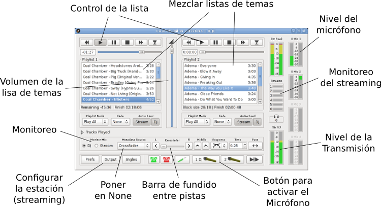

# Manual de uso IDJC

## Instalación

Abrir una consola y poner

<pre>
sudo apt-get update
sudo apt-get install idjc
</pre>

## Ventana principal

**Internet DJ Console** es una herramienta poderosa, flexible y dinámica que permite crear programación radial vía Internet.

En esta pantalla se puede crea la secuencia musical que se utilizará en el programa de radio.
Para agregar música arrastrar carpetas y/o archivos sobre alguna de las listas de reproduccion.
Haciendo doble click sobre una canción, ésta comenzará a reproducirse.

## Mezclar listas de temas

- **Stream** es el audio de lo que se transmite (al presionar los botones de dos estados “Stream” indicados en el punto anterior se activa o desactiva el audio que sale en la transmisión). 
- **DJ** es otro canal de audio, que permite poder escuchar otra cosa mientras se transmite (al presionar los botones de dos estados “DJ” se activa o desactiva el audio que sale en el modo DJ). 
- El **Metadata Source** colocar en **"None" (Nada)** muchos reproductores no soportarn metadatos.
- El **Crossfader** permite pasar el control de una Lista de temas a otra, de varias maneras: Los botones **L** y **R** pasan de inmediato, sin transición. La **barra del crossfader** permite hacerlo manualmente.

## Control del Micrófono

Este botón activa y desactiva el Micrófono. También puedes activar y desactivar éste control, presionando la tecla "m".

## Configurar la estación (Streaming)

Antes que nada vamos a necesitar un servidor podes conseguir un servidor Icecast en [giss.tv](http://giss.tv/addmount.html).
La configuración de servidores de streaming en **IDJC** se hace en la ventana de **"Salidas" (Output)**, al que se accede desde la ventana principal de **IDJC**. 
Para configurar el servidor de streaming al que **IDJC** se conecta primero hay que conocer los siguientes datos:

> - **Servidor de streaming:** http://giss.tv
> - **Número de puerto:** 8000
> - **Punto de montaje (nombre de la radio):** /nuestraradio.ogg
> - **Nombre de usuario:** nuestraradio
> - **Contraseña:** clave

La unión de servidor, puerto y punto de montaje dan la dirección de la radio:
[http://giss.tv:8000/nuestraradio.ogg](http://giss.tv:8000/nuestraradio.ogg)

### Configuración en IDJC

Para agregar un servidor, dentro de la sección **"Configuración" (Configuration)**, usar el botón **"Nuevo" (New)**.
Luego corresponde configurar el formato de salida. 

Si la colección de temas se encuentra en diferentes formatos, IDJC lo convierte todo al formato y calidad seleccionados.

> Dentro de la ventana siguiente se escriben los datos del servidor.

Si bien se pueden seleccionar varios formatos, muchos servidores de streaming prefieren usar el formato libre OGG, 
porque a diferencia de [mp3](https://es.wikipedia.org/wiki/MP3) no está [restringido por 
patentes](https://es.wikipedia.org/wiki/Vorbis#Historia).

	
**¡Importante!:** a menor calidad, mayor ancho de banda disponible. Si la conexión es lenta (3G por ejemplo) conviene bajar la calidad de 
salida y de muestreo. 

> Poner los metadatos en blanco, los reproductores todavia no soportan metadatos en **OGG**

¡Para comenzar a transmitir presionar el botón **Conectar (Connect)**!

## Monitoreo del streaming

Mientras se realiza la transmisión es posible monitorear la calidad de la conexión y la cantidad de usuarios conectados en la ventana principal de **IDJC**.
Algo que podemos hacer para evitar cortes es abrir **preferencias (prefs)** y poner reconexión automática y sin mostrar el cartel de dialogo.
