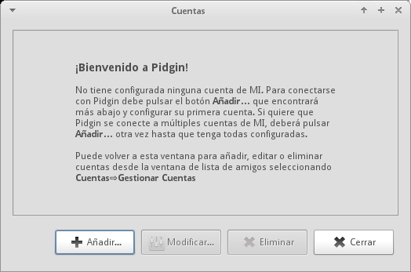
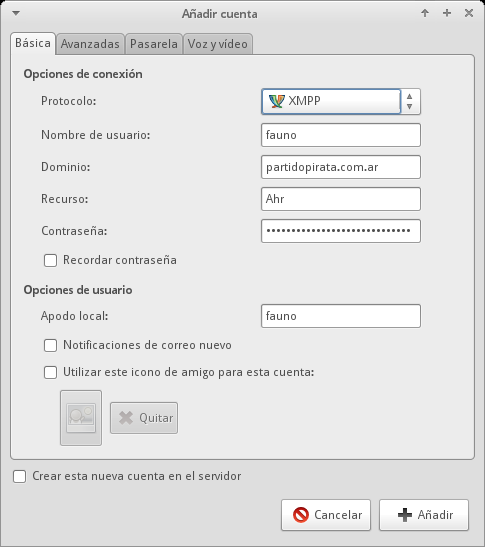
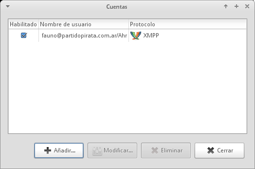
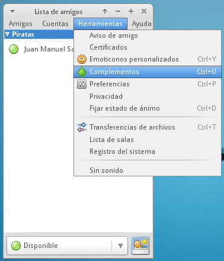
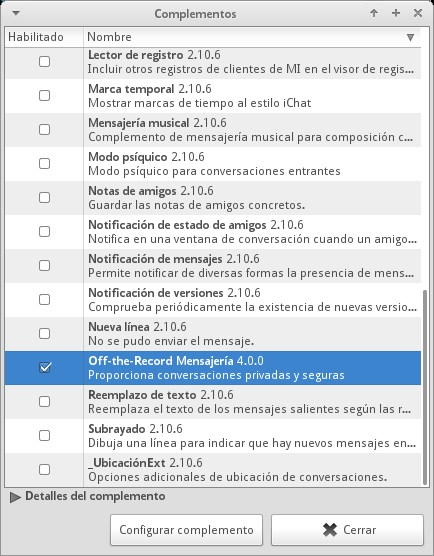
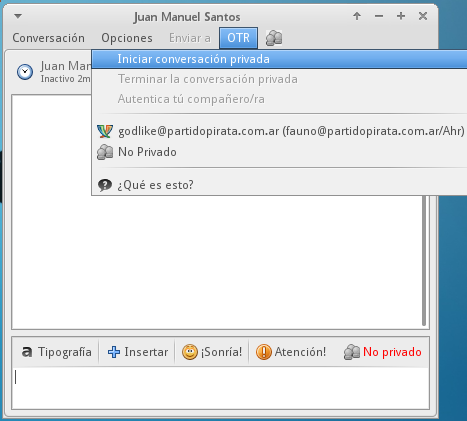
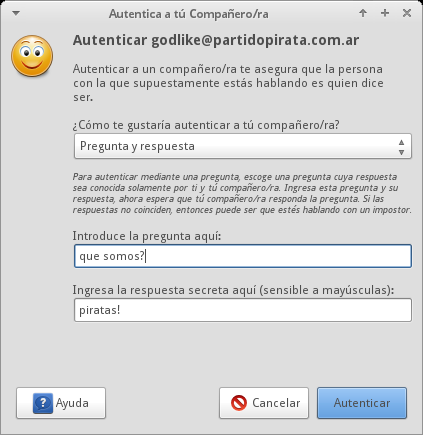
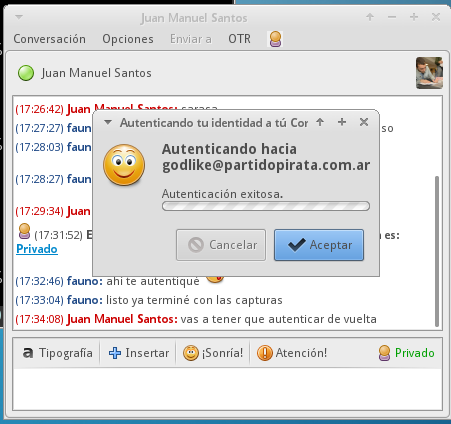
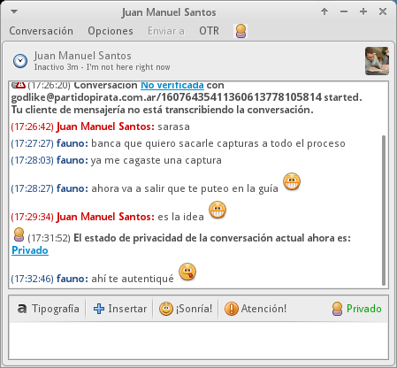

#  [Pidgin con OTR](http://wiki.partidopirata.com.ar/Pidgin_con_OTR)

Esta guía tiene dos partes, por un lado la configuración de las cuentas de Jabber (mensajería instantánea) del Partido 
Pirata en el cliente libre Pidgin y por otro, la configuración y uso de **Off-The-Record (OTR)**, el complemento de conversación 
criptográfica de Pidgin.

OTR asegura que las conversaciones no pueden ser interceptadas ni leídas por terceros (el PPAr, tu proveedor de interent, 
Google, la SIDE, el FBI, la CIA, la NSA, etc.) y que realmente hablamos con quien creemos que estamos hablando.

## Instalación

[Pidgin](https://pidgin.im) es un cliente de mensajería instántanea multicuenta y multiprotocolo que viene instalado por 
defecto en la mayoría de las distribuciones **GNU/Linux**.

Para utilizarlo con OTR, hay que instalar el complemento *pidgin-otr* desde el gestor de paquetes. Si estás usando M$ 
Windows, la descarga de [Pidgin con OTR](http://www.cypherpunks.ca/otr/index.php#downloads) habilitado puede hacerse desde 
el sitio de los desarrolladores bajo el link "win32 installer".

## Configuración de la cuenta

Al abrir Pidgin sin ninguna cuenta configurada, se abre el gestor de cuentas (¡ya que se pueden tener muchas!).

Seguir las instrucciones. Para añadir la cuenta del PPAr, hay que elegir [XMPP](https://es.wikipedia.org/wiki/XMPP) en tipo 
de cuenta y completar con los datos propios. El campo *Recurso* es abierto y puede dejarse vacío o completarse con la 
ubicación (en el caso de tener la misma cuenta en varias computadoras) o con cualquier cosa.

[

No hay que tildar "Crear esta nueva cuenta en el servidor" si no se tiene cuenta. 
Al guardar los cambios, el gestor de cuentas muestra las cuentas activas o inactivas.

> Las cuentas del PPAr muestran todos los Piratas registrados :)
> Lista de amigos piratas P)

## Activación de OTR

Luego de instalar el complemento, hay que habilitarlo.

> Menú de complementos

> Habilitar OTR

### Iniciar una conversación privada

> Ventana de conversación

Iniciar la conversación privada desde el menú OTR. La generación de la llave toma un tiempo y la ventana se bloquea. Para 
acelerar el proceso hay que mover el puntero del mouse o teclear.

Antes de poder iniciar una conversación segura, hay que asegurarse que la persona con la queremos hablar sea realmente 
ella. Para esto hay que "autenticar" la cuenta. Al autenticar, se comprueba que la llave de la otra cuenta está siendo 
utilizada por la persona con la queremos hablar y viceversa. Luego de este paso, OTR no vuelve a pedir este paso, pero sí 
hay que hacerlo con todos nuestros contactos.

El proceso de autenticación es necesario para saber si estamos hablando con quien creemos que vamos a hablar.

### Distintos modos de autenticación

OTR provee tres modos de comprobar que la persona con la que queremos hablar es realmente la que pensamos. En general la 
explicación que da el software es suficiente.

### Pregunta y respuesta

Pregunta con respuesta compartida. Hay que tener cuidado porque no vamos a leer la respuesta del compañero/a sino que Pidgin 
va a compararla con la que ya dimos. Si nuestro compañero/a la escribe distinto la autenticación va a fallar.

### Secreto compartido

En este paso hay que ponerse de acuerdo previamente en una "contraseña".

## Comprobación manual

En esto paso cada participante debe tener la huella de la llave OTR del otro, es decir la serie de letras y números que la 
identifica (en realidad son [números hexadecimales](https://es.wikipedia.org/wiki/Sistema_hexadecimal)).

## ¡Conversación privada!

Cuando la autenticación se completa, Pidgin avisará que la conversación no está siendo grabada (es decir que no quedan 
registros!), además de marcar "Privado" en verde en el menú.

## Quehaceres

- ejemplos con otras cuentas (jabberes, riseup, irc, facebook, google, etc)
