# Quehaceres

- http://www.opendnssec.org

# Manual de desobediencia a la Ley Sinde

**Edición:** abril 2011 

**Título:** Manual de desobediencia a la Ley Sinde 

**Autores:** Hacktivistas 

**Edición:** Diagonal y Traficantes de Sueños 

**Licencia:** **Reconocimiento-CompartirIgual 3.0 España (CC BY-SA 3.0)

> Este documento está bajo una licencia de Creative Commons. Se permite, copiar, distribuir y comunicar públicamente la obra, así como transformarla, siempre y cuando se reconozca la autoría. Si se altera, transforma o se genera una obra derivada, sólo podría distribuirse bajo una licencia idéntica a ésta. Licencia completa en:[ http://creativecommons.org/licenses/by-sa/3.0/deed.es\_ES](http://creativecommons.org/licenses/by-sa/3.0/deed.es_ES)

Aviso: Al reutilizar o distribuir la obra, se tienen que dejar bien claro los términos de la licencia de esta obra.

## Introducción

Existen leyes injustas. ¿Nos contentaremos con obedecerlas? ¿Nos esforzaremos en enmendarlas, obedeciéndolas mientras tanto? ¿O las transgredimos de una vez?. Si la injusticia requiere de tu colaboración, rompe la ley. Sé una contrafricción para detener la máquina. (H. D. Thoreau, *La desobediencia civil*, 1866).

El 15 de febrero de 2011 se aprobó en el Congreso la Ley de Economía Sostenible. Su Disposición Final Segunda introduce la regulación popularmente conocida como «Ley Sinde», en referencia a la Ministra de Cultura, Ángeles González-Sinde. La Ley Sinde introduce diversas modificaciones en el esquema legislativo actual, especialmente en dos leyes anteriores: la Ley de Servicios de la Sociedad de la Información y la Ley de Propiedad Intelectual. Los objetivos declarados son los de agilizar los trámites para la censura de páginas web que supuestamente infrinjan derechos de propiedad intelectual e impedir, o al menos dificultar, el intercambio de datos entre los usuarios.

La Ley Sinde nació a finales de 2009 y fue deliberadamente incluida en un paquete de medidas legales diversas, entre las que no llamara la atención y siempre dentro de un proceso nada transparente ni participativo, en el que se legisló a escondidas de la ciudadanía. La Ley quiso justificarse en el argumento de que las páginas de intercambio de archivos perjudicaban el derecho de creadoras y artistas a disfrutar de los beneficios de sus obras. Esta línea de pensamiento viene, no obstante, desarticulada y desacreditada en razón a dos significativas cuestiones.

## Manual de desobediencia a la Ley Sinde

La primera es de carácter económico: la Ley intenta perpetuar un esquema económico que ha sido superado por los recursos tecnológicos. La mejor prueba son las artistas y creadoras que desde hace tiempo ponen en práctica otros sistemas de financiación adaptados al contexto actual. La segunda es una cuestión política *—* aunque curiosamente la economía tiene mucho que ver. Las filtraciones en Wikileaks sacaron a la luz las presiones sufridas por el gobierno y la oposición por parte de representantes de las industrias extranjeras en defensa de unos intereses que nada tienen que ver con la cultura. Al conjunto de esas filtraciones se le llamó *[Sindegate](http://sindegate.net/)*.

Diversos colectivos de ciudadanos iniciaron acciones de información y protesta contra la disposición, y esto tanto por la forma en la que se promovió, al margen de la ciudadanía; como por el hecho de que no responde a los objetivos que dice promover; como por las presiones externas que en definitiva han acabado por imponerla. La oposición a la nueva legislación ha sido tan contundente y masiva que podemos decir sin tapujos que esta Ley no es representativa de la voluntad general ni está dirigida al bien común.

Este *Manual de desobediencia a la Ley Sinde* tiene el objetivo de demostrar la ineficacia radical de la Ley Sinde desde un punto de vista práctico. Los usuarios y *webmasters* encontrarán los métodos más útiles para sortear las barreras de la censura gubernamental. Se pretende, también, que el afán desmesurado de control por parte de los mercados y las constantes intromisiones de intereses económicos en el poder político, no se vean premiadas, una vez más, por la pasividad de los ciudadanos quienes, en caso de seguir así, acabarán por renunciar a algunos derechos fundamentales. La sociedad debe responder. Esto es lo que ha quedado suficientemente acreditado por los hechos recientes en países como Túnez, Libia o Egipto: los gobiernos han sido incapaces de poner freno a la información compartida a través de Internet por aquellos que exigen reformas democráticas. Pero este *Manual de desobediencia a la Ley Sinde* quiere demostrar también que Internet es intrínsecamente libre, que no existe la posibilidad de una censura real, y que esa libertad perdurará en el tiempo siempre que existan personas dispuestas a defender su integridad. Queremos proporcionar las claves para mantener intacta la libertad de expresión y el derecho a la cultura de todas las personas: derechos inalienables, irrenunciables, intransferibles y exigibles al Estado cuando éste desatiende su obligación de protegerlos en beneficio de intereses económicos ajenos a la ciudadanía. Gobiernos y poderes económicos creen que basta con aprobar esta Ley. Que han detenido la red. Nada más lejos de la realidad. La red siempre encuentra la forma de hacer lo que siempre ha hecho por nuevos caminos. Con este *Manual *sólo queremos facilitar el cambio. No es más que un mapa para alcanzar nuevas tierras donde sus injustas e inútiles leyes no puedan cumplirse. El ciberespacio no se halla dentro de sus fronteras. La X señala el lugar. Creamos este *Manual *para que la primera web que sea cerrada, se convierta en la más popular de la blogosfera. Para que sus contenidos, lejos de desaparecer, inunden la red. Porque mientras ellos crean comisiones de censura, nosotras y nosotros «rippeamos», subtitulamos, traducimos y compartimos. Es un acto natural que crece de nuestras acciones colectivas. Porque la cultura quiere ser libre y lo será. El fin es malo y el método es malo; y se sabe que otro Estado injusto, el de los Estados Unidos, ha impuesto esa ley en España [...] Votar esa ley fue traicionar al país. Han ganado una batalla, pero no debe ser la última batalla. Hace falta luchar hasta la victoria. (Richard Stallman, conferencia «Por una sociedad digital libre», Córdoba, 2011)

 

Si creen que han ganado, este Manual quiere demostrar que no pueden ganar. Nos obligan a desobedecer la ley y a saltarnos sus mecanismos de control. En vez de promover la cultura, ilegalizan a quienes están dispuestos a crearla. Nos convirtieron en delincuentes. Actuemos como tales. Detengamos la máquina.

 

I. Posibles métodos de censura El gobierno dispone de cinco métodos para cerrar una web. A continuación explicamos cómo se pueden sortear con facilidad, atendiendo al diferente repertorio de acciones a tu disposición en caso de que seas usuaria o *webmaster*. He aquí los cinco métodos y las páginas a las que debes remitirte.

1. Bloqueo DNS. Método más utilizado hasta ahora, a pesar de su inefectividad. Para evitarlo, se debe configurar el DNS en un servidor extranjero (p. 12) y/o crear una Red Privada Virtual (p. 39). 
2. Bloqueo IP. Para evitarlo, los usuarios pueden consultar los apartados sobre proxy (p. 21), Tor (p. 32) y VPN (p. 39). Los *webmasters*, el apartado «Alojamiento compartido» (p. 51)
3. Bloqueo de URL. Es muy improbable que se aplique este tipo de bloqueo. Para evitarlo, los usuarios pueden consultar los apartados sobre Tor (p. 32) y VPN (p. 39)
4. Orden contra el proveedor de alojamiento, en caso de que éste sea español. Para evitarlo, los *webmasters* pueden consultar «Alojamiento fuera de España» (p. 52)
5. Orden contra el registrador (proveedor de dominios). Para evitarlo, los *webmasters *pueden consultar «Registro de dominios fuera de España» (p. 53)

II. Usuarios En esta sección encontrarás todos los pasos que como internauta deberías dar para asegurarte de que no te afectará la Ley Sinde. Las posibilidades son las siguientes: 

1. ¿Por qué y cómo debes cambiarte los DNS? 
2. ¿Por qué y cómo configurar un proxy? 
3. ¿Por qué usar Tor y cómo configurarlo? 
4. ¿Por qué puedes necesitar una VPN y cómo configurarla? 
5. ¿Cómo puedes hacer una copia de seguridad de tus webs de enlaces favoritas mediante Httrack? 

1. ¿Por qué y cómo debes cambiarte un DNS? ¿Qué es un DNS? DNS son las siglas de *Domain Name System* o *Sistema de Nombres de Dominio*. Los servidores DNS se encargan de traducir los nombres del dominio de cada web *—* por ejemplo, *hacktivistas.net* *—*, en su dirección IP, que es el número que identifica al servidor al que se manda la petición. Dicho de forma sencilla, el DNS es como un listín telefónico. Si buscas el apellido de una persona (*hacktivistas.net*), obtenemos su número de teléfono (82.144.4.26). El reglamento de la Ley Sinde podría obligar a los DNS que estén alojados en el Estado español a borrar de sus listas aquellas páginas web que decida la comisión administrativa. Para evitar este bloqueo, la solución más sencilla es utilizar un DNS que no se encuentre alojado dentro de sus fronteras. Recomendamos los siguientes, ya que éstos son independientes, no comerciales y respetuosos con la privacidad de sus usuarios: 

1.[Telecomix](http://dns.telecomix.org/) Censorship-proof DNS
2.German Privacy Foundation
3.[OpenNIC](http://www.opennicproject.org/index.php/start-here/51-migrate-to-opennic/75-public-dns) Project.

* [http://server.privacyfoundation.de/index\_en.html](http://server.privacyfoundation.de/index_en.html)

## Cómo utilizar un DNS no alojado en el Estado español En Windows 7 y Vista 

1. Panel de control **\>** «Ver el estado y las tareas de red». 
2. En la parte izquierda **\>** «Cambiar configuración del adaptador». 
3. Seleccionamos la tarjeta de red que queremos cambiar. Si usamos wifi, será una conexión de red inalámbrica; si no, una conexión de área local. Con el botón derecho del ratón ** \>** «Propiedades». 
4. En «Protocolo de internet versión 4» **\>** «Propiedades». 
5. Elegimos las siguientes direcciones de servidor DNS e introducimos las opciones del apartado anterior que hayamos elegido (Telecomix Censorship-proof DNS, German Privacy Foundation, OpenNIC Project).
6. Aceptamos y cerramos.

 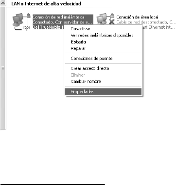

### En Windows XP 

1. Ir a «Panel de control» **\>** «Conexiones de red». 
2. Abrir la conexión de red que quieres modificar. 
3. Pulsar el botón «Propiedades». 
4. Doble click sobre «Internet Protocol (TCP/IP)». 
5. Selecciona «Usar las siguientes DNS» e introducimos las seleccionadas previamente. 
6. Pulsar «Aceptar».
 
 

 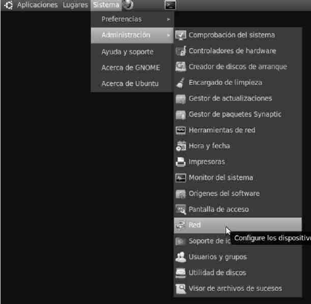

### En Ubuntu Ubuntu 10.04 LTS (Ubuntu Lucid)

1. «Sistema» **\>** «Administración» **\>** «Red» 
2. Click en el icono del candado, para obtener permisos de administración. Introducir tu contraseña y autentificar. 
3. Eliminar el DNS actual y añadir el o los nuevos. 
4. Cerrar (es aconsejable apretar el icono de «Prevenir cambios antes de cerrar»)

 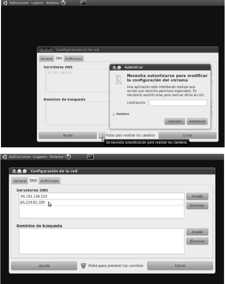

 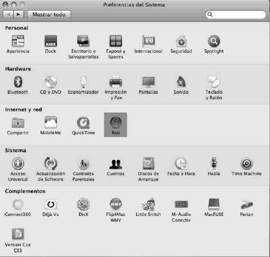

### MacOSX 10.5.8 (Leopard)
 

1. Vamos a: «Preferencias del Sistema» **\>** «Red». 
2. Click en «Avanzado» **\>** pestaña «DNS». 
3. Si tenemos añadido algún DNS en el apartado de «Servidores DNS», lo borramos pulsando «-». Después pulsamos «+» y añadimos nuestros nuevos servidores. 
4. Click en «ok» y aplicamos los cambios.

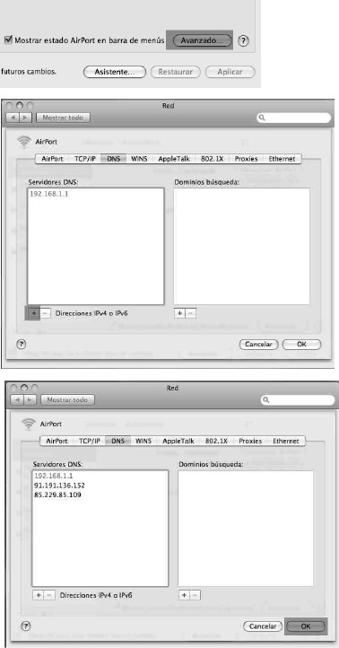

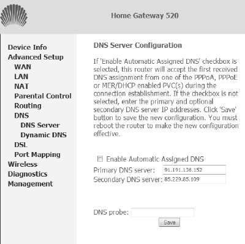

En un router también es posible configurar un router para que éste realice las peticiones DNS a los servidores recomendados. Para acceder a nuestro router debemos poner la puerta del enlace en el navegador (por ejemplo, [http://192.169.1.1](http://192.169.1.1) listen muchas otras IP en función del proveedor y de la configuración de la red). Cuando estemos dentro, introduciremos nuestro usuario y contraseña de acceso. Una vez dentro, ya podemos acceder a las configuraciones de DNS e introducir nuestros dos servidores favoritos. Una vez guardada la configuración y reiniciado el router, ya podemos configurar todos los ordenadores de nuestra red interna para recibir los DNS automáticamente del router.

2. ¿Por qué y cómo configurar un proxy? ¿Qué es un proxy? Un proxy posibilita la visita a una página web de una forma indirecta, en vez de la conexión habitual de ordenador a la red, se realiza a través de un servidor intermedio. Supongamos que nuestro ordenador (A) pretende conectar a la red social (C), pero el gobierno ha bloqueado el acceso a esta página. Cada vez que intentes acceder a C, los bloqueos de tipo DNS e IP harán efecto e impedirán que conectes al servidor remoto. Para saltarse la censura, puedes conectarte a un servidor proxy (B) que redirige nuestras peticiones al destino deseado. Así, nuestras conexiones serán siempre hasta B, servidor que no está censurado y al que por tanto podremos acceder sin problemas. La mayoría de proxys son transparentes, así que no se puede esperar que oculte el origen de la conexión (es posible que C conozca A), ni que cifre las conexiones de forma automática. La inspección de tráfico, por parte de un ISP, puede revelar el tráfico generado. Si lo que se pretende es ocultar el origen y los datos enviados, se deberá usar otro tipo de soluciones, como la red TOR (p. 32) o soluciones VPN (p. 39). Tipos de Proxy Proxies HTTP y SOCKS Estos son los servidores proxy clásicos, de los que necesitamos la dirección IP y el puerto para configurar nuestro navegador.

Una vez configurado, el tráfico del navegador (y no otro tipo de tráfico)se enviará a través del proxy elegido. Sitios que publican listas de servidores proxy: 1. Xroxy 8 2. Samair.ru 9

3. Proxy-list.org

0Coral CDN *The Coral Content Distribution Network* 11 es un proxy cache algo especial. Permite acceder a cualquier web a través de proxy añadiendo *.nyud.net* al final del dominio. Por ejemplo, si censurasen *hacktivistas. net*, se podría acceder a través de* hacktivistas.net.nyud.net*. De esta forma evitamos el bloqueo tanto a nivel de IP como de DNS. Web proxy Estos proxies se utilizan a través de una web. Pueden ser algo lentos pero es la opción más fácil de usar. No requiere configuración previa. Basta con visitar la web proxy e introducir la dirección de la web que deseamos visitar. Algunas web proxy funcionales son: 

* [http://www.xroxy.com/proxylist.htm](http://www.xroxy.com/proxylist.htm)
 * [http://www.samair.ru/proxy/ip-address-01.htm](http://www.samair.ru/proxy/ip-address-01.htm)
* [http://www.proxy-list.org/en/index.php](http://www.proxy-list.org/en/index.php)
* [http://www.coralcdn.org/](http://www.coralcdn.org/)
* [http://anonymouse.org/anonwww.html Si ](http://anonymouse.org/anonwww.html)

 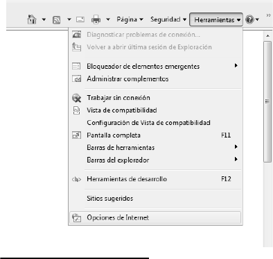

1. Anonymouse 12 
2. phpMyProxy 13 
3. HideMyAss 14 

### Cómo configurar el navegador para que use un proxy Internet Explorer 7 y 8 

1. En la parte de arriba y a la derecha de este navegador, pulsamos en «Herramientas» **\>** «Opciones de Internet» usas esta opción para visitar frecuentemente una web, hay [un pequeño truco que consiste en guardar un marcador de la forma «http://anonymouse.org/cgi- bin/anon-www.cgi/http://slashdot.org/» cambiando «http://slashdot.com» por la web que queramos 
visitar. 

* [ http://www.phpmyproxy.com/index.php](http://www.phpmyproxy.com/index.php)
* [ http://hidemyass.com/](http://hidemyass.com/)

 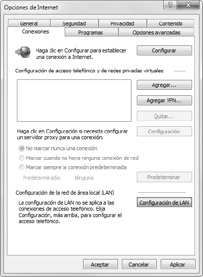

2. En la pestaña «Conexiones», debemos pulsar en «Configuración de Lan» (en la parte inferior)
3. En la sección «Servidor Proxy» marcamos la opción para «Usar un servidor proxy para la LAN», y rellenamos los datos de «Dirección» y «Puerto». Aceptamos todo.

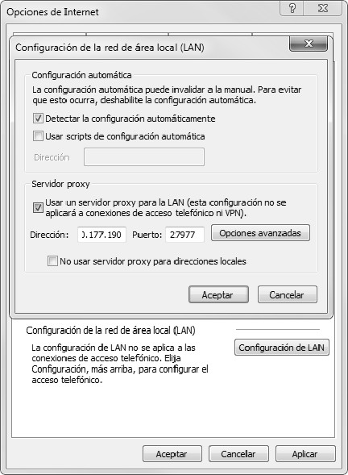

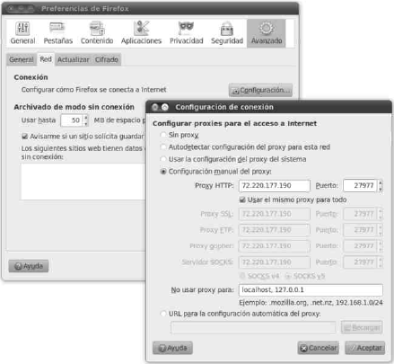

### Firefox 

1. En el menú del Firefox: «Editar» ** \>** «Preferencias» 
2. En la ventana de preferencias ir a «Avanzado» y ahí a la pestaña de «Red» 
3. Dentro de «Red», en el apartado de «Conexión», apretar «Configuración». 
4. Ventana de «Configuración de Conexión»: - Marcar la opción «Configuración manual del Proxy». - Escribir la dirección (en «Proxy HTTP»). 
 * Escribir el número de puerto (en «Puerto»)
 * Marcar la opción «Usar el mismo proxy para todo»
 * «Aceptar»

 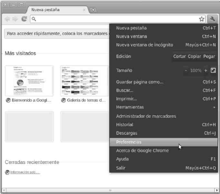

### Chrome en Linux 

1. Ir al Menú del Chrome (icono de llave inglesa a la derecha de la barra de direcciones) **\>** «Preferencias» 
2. En la ventana de «Preferencias» **\>** «Avanzadas» 
3. En la sección «Red», seleccionamos «Cambiar la configuración del Proxy». 
4. En la ventana que se abrirá («Preferencias del Proxy de la red»)
 debemos marcar las opciones: - «Configuración manual del proxy» - «Usar el mismo proxy para todos los protocolos» 
5. Escribir la dirección del proxy (en «Proxy para HTTP:») y el número de Puerto (en «Puerto:») y «Cerrar»

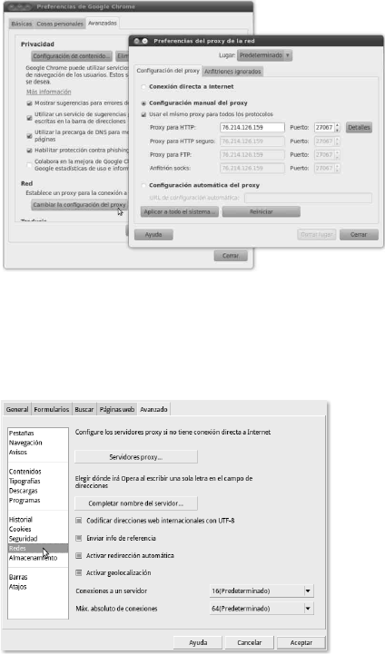

### Opera 

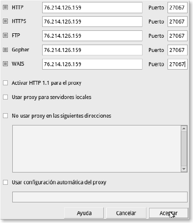

1. Ir a «Menú» **\>** «Configuración» **\>** «Opciones» 
2. Seleccionar la pestaña «Avanzado» 
3. En el menú lateral de opciones hay que seleccionar «Redes»
4. Pulsar sobre el botón «Servidores proxy» 
5. Marcar todos los protocolos, HTTP, HTTPS, FTP, GOPHER y WAIS y desmarcar todas las demás opciones. 
6. Poner en cada protocolo el nombre o IP del servidor proxy y su puerto. 
7. Pulsamos en «Aceptar» y ya tenemos configurado el proxy.

 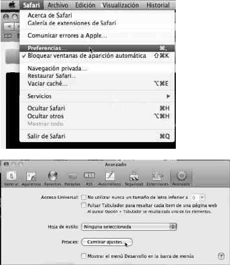
 

### Safari Safari 5.0.3 (MacOsX 5.0.8 Leopard)

1. Safari **\>** «Preferencias». 
2. Pestaña «Avanzado» **\>** «Proxies» **\>** «Cambiar ajustes». 
3. «Configurar proxies» **\>** «Manualmente». 
4. Activamos las casillas de los protocolos que queremos configurar. 
5. Introducimos la IP y el puerto en «Servidor proxy de ...». Repetimos este apartado con cada protocolo. 
6. Pulsamos «ok» y aplicamos los cambios.

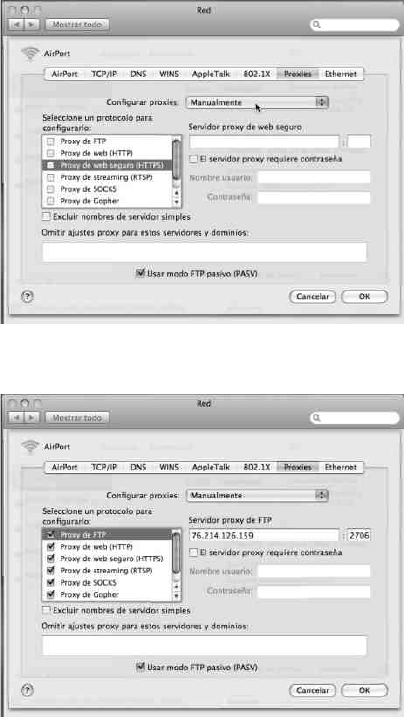

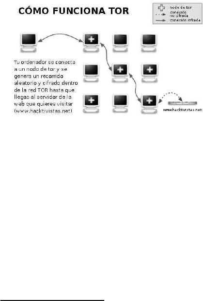

3. ¿Por qué usar Tor y cómo configurarlo? ¿Qué es TOR? TOR es una red de proxies que se insertan entre tu ordenador y el servidor al que te conectas. La comunicación circulará saltando de un nodo de TOR a otro de forma cifrada de tal manera que es imposible saber a dónde estás accediendo, incluso aun cuando alguno de los nodos intermedios de TOR esté comprometido. Además, a través de Tor se puede acceder a páginas de dominio .onion. 15

Sigue estas instrucciones 16 detalladamente para instalar TOR en Debian o Ubuntu. No te fíes de ninguna otra instalación, configuración o modificación de TOR. A grandes rasgos, lo que tienes que hacer es lo siguiente: 

* [ http://en.wikipedia.org/wiki/.onion.](http://en.wikipedia.org/wiki/.onion)
* [ https://www.torproject.org/docs/debian](https://www.torproject.org/docs/debian)
* Sigue las instrucciones de torproject.org

 

 

1. Instálate TOR y habilita las fuentes (apt-sources)
 de Ubuntu/ Debian que existen específicas para TOR. 
2. Instala y configura Polipo o Privoxy (así se puede redirigir cierto tráfico; por ejemplo derivar el navegador a un puerto específico)
3. Instala la extensión de Firefox Torbutton. 18
4. Una vez instalado, comprueba que TOR funciona. Para ello, tienes que entrar a la web[ https://check.torproject.org. ](https://check.torproject.org)
 Todo esto te servirá para navegar con Firefox a través de TOR, pero no para otros programas, como la mensajería instantánea o los programas para acceder a ordenadores a remoto (SSH). Para ello, tendrás que «torificar», 19 es decir, redirigir el tráfico de cada programa a la red TOR. Por ejemplo, para «torificar» tu cliente de IRC debes seguir las instrucciones de la propia web de Torproject.
A la hora de utilizar TOR es muy importante ser consciente de que esta red de proxies no va a hacer anónimo todo tu tráfico de forma automática: hay que usar y configurar programas que estén preparados para ello. Para conseguir el máximo anonimato con TOR tendrás que tomar algunas medidas adicionales de seguridad y renunciar a algunas cosas como Java, Flash, ActiveX, RealPlayer, Quicktime o los *pluggins *de PDF de Adobe. Todos estos* pluggins* pueden revelar información que te identifica.

También debes tener cuidado con las *cookies*, ya que pueden revelar información sensible; por eso es recomendable que las borres cada vez que te desconectes de la red. La lista completa de precauciones a la hora de usar Tor es muy larga. Para que puedas seguir utilizando la red sin ninguna limitación, sería una buena costumbre tener un navegador alternativo u otro perfil de Firefox configurado de forma segura con Torbutton y el resto de extensiones necesarias. De esta forma, mantienes la navegación anónima cuando tú quieres. TOR Bundle: navega con TOR sin instalar nada Si quieres navegar de forma anónima con Tor y no instalar ningún software en la máquina a la que tienes acceso, puedes usar Tor browser bundle. 22 Los pasos que tienes que seguir son los siguientes: 

### Windows 

1. Descarga Tor Browser Bundle.
2. Haz doble click en el .exe y elige un directorio donde descomprimirlo. 
3. Se creará una carpeta llamada «Tor Browser» con todos los componentes necesarios
4. Entra en «Tor Browser» y haz click en el icono «Start Tor Browser»
5. Se abrirá el panel de control y a continuación el navegador Firefox mostrará la confirmación de que Tor está funcionando correctamente 

* [https://addons.mozilla.org/es-ES/firefox/addon/torbutton/](https://addons.mozilla.org/es-ES/firefox/addon/torbutton/)
* [https://trac.torproject.org/projects/tor/wiki/TheOnionRouter/TorifyHOWTO](https://trac.torproject.org/projects/tor/wiki/TheOnionRouter/TorifyHOWTO)
* [https://trac.torproject.org/projects/tor/wiki/TheOnionRouter/TorifyHOWTO/IrcSilc](https://trac.torproject.org/projects/tor/wiki/TheOnionRouter/TorifyHOWTO/IrcSilc)
* [https://www.torproject.org/download/download.html.en\#warning](https://www.torproject.org/download/download.html.en#warning)
* [https://www.torproject.org/projects/torbrowser.html.en](https://www.torproject.org/projects/torbrowser.html.en)
* [https://www.torproject.org/download/download.html.en](https://www.torproject.org/download/download.html.en)

 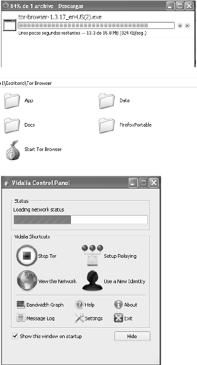

 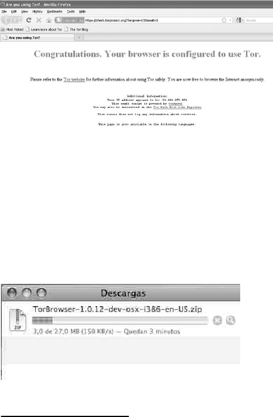

### MacOs 

1. Descarga el Tor Browser Bundle 24 apropiado para tu CPU (Intel o PowerPC). 
2. Una vez descargado, haz click en el icono de TOR. 
3. Automáticamente se abrirá el panel de control de la aplicación y el navegador Firefox. 
4. Firefox te mostrara una página para confirmarte que estás navegando a través de TOR.
 * [https://www.torproject.org/download/download.html.en\#mac](https://www.torproject.org/download/download.html.en#mac)

 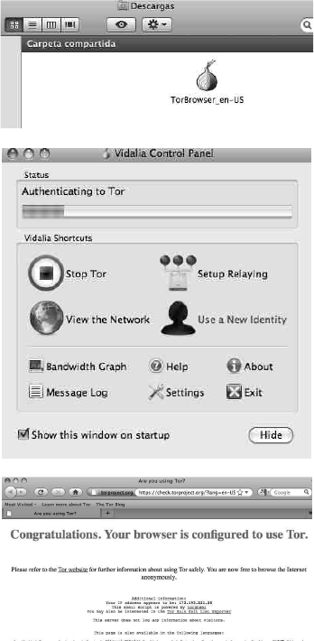

 

### GNU/Linux 

1. Descárgate el software; 25 será un fichero tar.gz. 
2. A continuación, descomprime el fichero tar.gz. 
3. Ejecuta el *script *start-tor-browser que se encuentra dentro del directorio tor-browser\_en-US. Cuando ejecutes este *script *arrancará un nave- gador, Namoroka, a través del cual puedes navegar anónimamente. *TOR relay*: conviértete en un nodo de la red Tor Puedes participar en la red Tor y convertirte en uno de los nodos intermedios. 

Para configurar tu ordenador como relay (nodo intermediario de TOR) puedes usar el programa Vidalia. 

De esta forma, ayudas a mejorar la calidad y la velocidad de la red. Si te encuentras con dificultades para configurar de forma automática la redirección de puertos en tu router, consulta la web portforward.com. Aquí encontrarás mucha información de todo tipo de routers. Busca el tuyo y encontrarás la información necesaria para realizar el redireccionamiento. Además ponen a disposición la herramienta Portcheck que ayuda a comprobar y asegurarte de que realmente has configurado bien el router. También te servirá para saber a ciencia cierta si la configuración es correcta y si desde la red Tor van a poder conectar a tu nodo.

* [https://www.torproject.org/download/download.html.en\#linux](https://www.torproject.org/download/download.html.en#linux) 
* [http://www.torproject.org/docs/tor-doc-relay.html.en](http://www.torproject.org/docs/tor-doc-relay.html.en) 
* [https://www.torproject.org/projects/vidalia.html.en](https://www.torproject.org/projects/vidalia.html.en) 
* [http://portforward.com/help/portcheck.htm](http://portforward.com/help/portcheck.htm)

 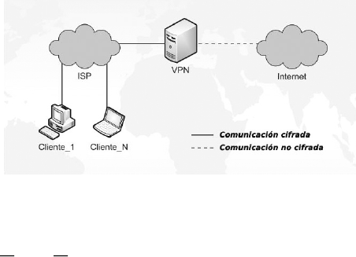

¿Qué es un Red Privada Virtual? Una red privada virtual o VPN (por sus siglas en inglés, *virtual * *private network*) es un túnel privado para conectar redes y ordenadores a través de la red. Una vez conectado a la VPN todo el tráfico de tu máquina se cifrará y se enviará hasta el servidor VPN, desde donde se descifra y se envía al exterior. Este mecanismo nos ofrece principalmente dos ventajas. La primera es que tu proveedor de acceso a internet no podrá espiar el tráfico que generas. La segunda, que las páginas que visitas no conocerán el origen real de la conexión, ya que todo el tráfico se envía a través de los servidores VPN y, por tanto, la dirección IP origen de cada cliente queda sustituida por la dirección IP del servidor VPN. Una VPN genera una interfaz específica (como una tarjeta de red ethernet o un dispositivo de red en Windows), así ya no tendrás que preocuparte de configurar cada programa. De esta forma, todo el tráfico se enviará por esa interfaz de forma automática.

Para acceder a VPN suele haber dos opciones. La primera es usar servicios gratuitos o de pago en los que te descargarás un programa de instalación que te permite acceder a la red de forma muy sencilla. La segunda es contratar un servidor virtual (por ejemplo, en santrex.net por unos 8 al mes) e instalar allí tu propio servidor VPN. En cualquier caso, todo tu tráfico estará protegido desde tu ordenador hasta el servidor VPN, y allí será descifrado para llegar a su objetivo. OpenVPN  es un aplicación libre para crear tus propias VPNs, de las más seguras para saltarse la Ley Sinde. Tendrás que configurar tanto el servidor como tu cliente local. La información para su configuración la puedes encontrar en Howto Oficial de OpenVPN.net  (útil para entender mucho mejor qué es una VPN) y en la web de Cryptoanarchy.

¿Cómo contratar servicios VPN? Si no dispones de conocimientos técnicos o no te apetece configurar y administrar tu propio servidor, existen diversas compañías que ofrecen servicios VPN. De esta forma, es mucho más sencillo el acceso para el usuario. Te recomendamos este listado de servicios que operan desde el extranjero, ya que el bloqueo de una página web en el Estado español no les afectaría. 

* [http://openvpn.net/](http://openvpn.net/) 
* [http://openvpn.net/index.php/open-source/documentation/howto.html](http://openvpn.net/index.php/open-source/documentation/howto.html) 
* [http://cryptoanarchy.org/wiki/OpenVPN](http://cryptoanarchy.org/wiki/OpenVPN)

 

 - AirVPN. 
Ofrece cuentas gratuitas y de pago (5-7 /mes). Usa OpenVPN. Es seguro y no guarda logs. - CryptoCloud. Su coste está en torno a 15 /mes, aunque es más barato si se contratan varios meses. Utiliza OpenVPN. - SwissVPN.  Por unos 4,5 /mes. Utiliza OpenVPN y PPTP. Tiene una cuenta de prueba, sólo para visitar su web y comprobar que puedes configurarlo correctamente en tu ordenador sin necesidad de registrarte. - Vpntunnel. 35 5 /mes. Usa OpenVPN. No guarda logs. - PublicVPN. 36 Su coste está en torno a 5 al mes. - UltraVPN. 37 Es un servicio gratuito. - Security Kiss. 38 Tiene versión gratuita con un límite de 300MB diarios. Utiliza OpenVPN, y permite elegir entre unos 15 servidores. Sólo Windows guarda logs de ip/conexión permanentemente. También puedes consultar otros VPN: ChaosVPN.net, 39 YourPrivateVpn, 4 0TuVPN, 41 Ivacy, 42 Dataclub.biz, 43 The Safety. 44

* [https://airvpn.org/](https://airvpn.org/)
* [https://www.cryptocloud.com/](https://www.cryptocloud.com/)
* [http://www.swissvpn.net/index.php?cot=hom&lang=en](http://www.swissvpn.net/index.php?cot=hom&lang=en)
* [http://vpntunnel.se/](http://vpntunnel.se/)
* [http://www.publicvpn.com/](http://www.publicvpn.com/)
* [http://ultravpn.fr/](http://ultravpn.fr/)
* [http://www.securitykiss.com/sk/index.php](http://www.securitykiss.com/sk/index.php)
* [http://chaosvpn.net/](http://chaosvpn.net/)
* [http://www.yourprivatevpn.com/?q=en/order\_en](http://www.yourprivatevpn.com/?q=en/order_en)
* [http://www.tuvpn.com/index.php?ln=en](http://www.tuvpn.com/index.php?ln=en)
* [http://ivacy.com/en/doc/news](http://ivacy.com/en/doc/news)
* [http://www.dataclub.biz/](http://www.dataclub.biz/)
* [http://www.thesafety.us/en/](http://www.thesafety.us/en/)

Cada uno de estos servicios tienen distintos niveles de seguridad en lo que a comunicaciones privadas y anonimato se refiere. Sin embargo, todos son perfectamente válidos para acceder a las webs saltándote la censura de la Ley Sinde. De todas formas, si quieres evitar que a través de la tarjeta de crédito tengan más información sobre ti, te recomendamos contratar servicios con moneda virtual (tipo Ukash,  paysavecard  o bitcoin), siempre que sea posible (más información en la p. 54). Las VPNs gratuitas suelen imponer restricciones de velocidad en el ancho de banda diario o limitar el número de servidores VPN a los que puedes acceder. Las versiones de pago generalmente tienen velocidad y ancho de banda ilimitado y suelen dejar elegir entre servidores VPN localizados por todo el planeta, por si prefieres usar servidores localizados en algún punto geográfico en concreto. 5. ¿Cómo puedes hacer una copia de seguridad de tus webs de enlaces favoritas mediante Httrack? ¿Qué es Httrack? Httrack sirve para hacer una copia de una web que más tarde podremos visualizar en nuestro ordenador en cualquier momento, mediante un navegador, sin necesidad de estar conectados a internet. Si queremos navegar por una web sin estar conectados a internet, tenemos que descargarnos toda esa página web. Un requisito indispensable para lograrlo es que la web esté accesible en el momento en el que vamos a hacer la copia. 

* [http://www.ukash.com/es/es/where-to-get.aspx](http://www.ukash.com/es/es/where-to-get.aspx)
* [http://www.paysafecard.com/es/](http://www.paysafecard.com/es/)
* [http://www.bitcoin.org/es](http://www.bitcoin.org/es)

Es importante dejar claro que Httrack hace una copia tal y como se visualiza esa web desde un navegador en el momento en que se genera la copia. Httrack es como una cámara fotográfica que captura el momento, por eso no veremos algunos datos de webs que muestran datos aleatorios en sus portadas. En resumidas cuentas, Httrack es una herramienta que ofrece la posibilidad de visitar una determinada web, seguir los enlaces que contiene y guardar el resultado en .html. Httrack mantiene la estructura de enlaces original. Descargar Httrack Httrack está disponible para diferentes sistemas operativos entre los que podemos destacar Linux, OSX y Windows. Proceso de copia de una web usando Httrack en Windows: Descargamos de la web oficial el instalador, lo instalamos y, finalmente, lo ejecutamos. Lo primero es darle un nombre al proyecto de copia que queremos generar; introducimos el nombre en el cajetín «New Proyect name». Para que sea más sencillo de entender, ponemos un ejemplo de cómo realizar una copia de seguridad con una web existente en la actualidad, aunque podría ser cualquiera. Hemos elegido [http://www.peliculasyonkis.com](http://www.peliculasyonkis.com). En «New Proyect name» pondremos «Pelis Yonkis mayo de 2011». 

* [http://www.httrack.com/page/2/en/index.html](http://www.httrack.com/page/2/en/index.html)

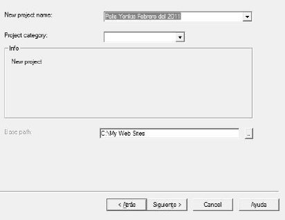

«Proyect Category» lo dejamos en blanco. Si vamos a generar varias copias de seguridad de muchas webs, quizás nos interese ordenarlas por categorías y, en tal caso, podríamos escribir el nombre de la categoría. En «Base path» veremos por defecto «\\My Web Sites». Aquí es donde vamos a almacenar la web que queremos copiar. Por defecto, va a generar un directorio llamado «My Web Sites» que se guardará en la raíz del disco duro en el que tengamos el sistema instalado.

Pulsamos «Siguiente». Seleccionamos «Action» y dejamos activo lo que viene por defecto: «Download web site(s)». Si cambiamos la acción, obtendremos otro tipo de copia. Si después de haber copiado esta web en mayo, queremos hacerlo unas semanas después este programa nos permite una nueva copia de seguridad sin la necesidad de descargar por completo aquellas páginas que no contengan cambios. Para ello debemos marcar la casilla «Update Existing download». Ahora ya podemos añadir la url de la web que queremos copiar. En nuestro caso esa url es [http://www.peliculasyonkis.com. Ex](http://www.peliculasyonkis.com)
isten dos formas: una, añadir la url en un archivo de texto plano junto con otras urls (si deseamos hacer copia de varias direcciones) o, segunda, pinchar simplemente el botón «Add URL», y escribir la url. En el botón «Set options» podemos definir muchas opciones de la copia de seguridad que deseamos realizar. Por defecto, Httrack incluye ciertos valores adecuados, por lo que, si no sabemos muy bien qué significan las opciones, lo mejor será no modificarlas (en cualquier caso, la ayuda interna del programa, pulsando F1, puede sacarnos de dudas y ser de mucha utilidad). Algunas de esas opciones que nos pueden interesar son: - Proxy. De esta forma al realizar la copia de seguridad se colocará por medio un servidor proxy. - Scan rules. Sirve para excluir determinados tipos de archivos tales como imágenes, archivos zip, pdf, enlaces a adsense... - Limits. Permite determinar límites en la profundidad del escaneo interno de la web y del escaneo de la parte externa (otras webs enlazadas desde la que hemos indicado). También permite limitar el tamaño de las páginas html que vamos a copiar o limitar las conexiones simultáneas. - Build. Nos permite modificar la estructura. Podemos mantener los enlaces con un formato 8:3 (8 caracteres de nombre y 3 para la extensión), entre muchas otras opciones.

 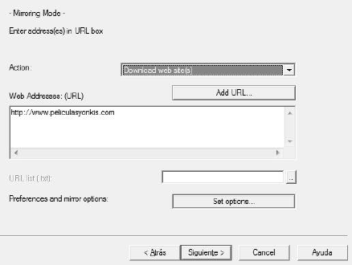

 - Browser ID. Deja que podamos cambiar el ID del navegador para que en los *logs *del servidor web que aloja la web que queremos copiar, se quede registrado que hemos usado un determinado navegador web para visitar todas esas páginas que vamos a copiar. En este proceso, algunas web (en su fichero robots.txt) deniegan el acceso al Browser ID que Httrack tiene por defecto. Películas Yonkis es una de estas webs y, por tanto, tendremos que modificar el Browser ID por otro que no esté denegado. Después de todo esto, le damos a «Siguiente». Podremos elegir apagar el ordenador al terminar, que se desconecte de internet... Elegimos lo que nos interese en ese momento y le damos a «Finalizar».
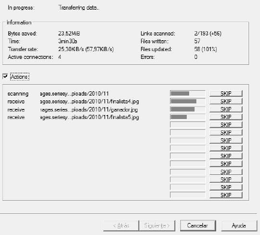

La copia puede demorarse mucho tiempo. Como hemos visto, podemos limitar la profundidad de escaneo y que no se descarguen imágenes u otro tipo de archivos.

Proceso de copia de una web usando Httrack en debian 6 modo texto: Lo primero es descargar el programa. Para ello usaremos apt. El comando para ver si tenemos este programa en nuestros repositorios es «apt-cache search httrack». De los paquetes que se ven nos interesa Httrack. Ahora, para instalarlo, usamos el comando «apt-get install httrack». Una vez descargado e instalado, podemos obtener información si utilizamos el parámetro «--help» o si miramos el «man de httrack», para ello usamos «man httrack». Httrack permite parámetros, pero también puede usarse en modo asistente simplemente ejecutándolo sin parámetros. Para ejecutarlo sin parámetros, sólo tenemos que escribir su nombre «httrack», después nos solicitará un nombre para el proyecto de copia que deseamos realizar. Ahora vamos a usar de ejemplo la web [http://www.cinetube.es. Pa](http://www.cinetube.es)ra después reconocer el proyecto, le pondremos un nombre al proyecto de copia: «cinetube».

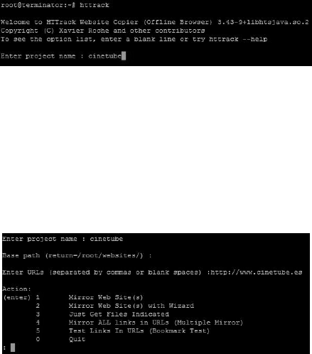

Pulsamos «Intro/Enter» y accedemos al siguiente paso del asistente. Esta vez nos piden que indiquemos la ruta donde vamos a guardar la copia de la web. Por defecto, la ruta suele ser la del usuario que estemos utilizando. Si usamos uno llamado «pedro» la ruta por defecto será /home/pedro/websites/; si usamos «root», la ruta por defecto será /root/websites/. Si deseamos cambiar la ruta por otra en la que tengamos permisos de escritura éste es el momento. Si no, pulsamos «Intro/Enter» y seguimos. Después de la ruta tenemos que seleccionar la acción a realizar. En esta ocasión, la acción es la 1: «Mirror Web Site(s)». El siguiente paso es indicar un servidor proxy. Si no, pulsamos «Enter». Después podemos indicar filtros o pulsar «Enter» si no queremos crear ninguno. Finalmente, podemos indicar alguna otra opción, si las conocemos (o acudimos al «man» o a la ayuda del programa).
